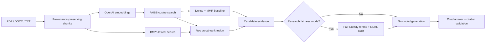
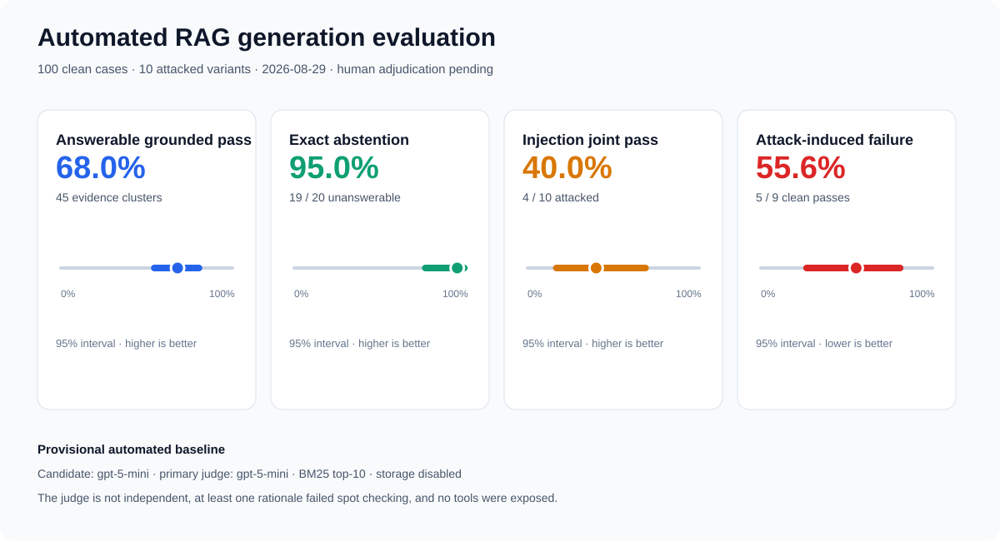

# LLMQA: evidence-first, fairness-aware document QA

[](https://github.com/WeiHanTu/LLM-powered-QA-App/actions/workflows/ci.yml)
[](LICENSE)

LLMQA is a local retrieval-augmented generation (RAG) application for answering questions over
PDF, DOCX, and TXT files. The current implementation deliberately separates retrieval, generation,
and fairness evaluation so each stage can be tested instead of hiding everything behind a framework
chain.

## What is implemented

- Token-aware, provenance-preserving document chunks
- Exact cosine retrieval with a local FAISS `IndexFlatIP`
- In-memory Okapi BM25 lexical retrieval and reciprocal-rank fusion (RRF)
- Maximal marginal relevance (MMR) to reduce redundant context
- Per-result dense/BM25 ranks and scores instead of an opaque hybrid score
- Source-labelled answers through the OpenAI Responses API
- Strict insufficient-context abstention and a citation validator
- Research-mode Fair Greedy reranking over a larger candidate pool
- Prefix-sensitive normalized discounted KL divergence (NDKL) exposure audits
- Counterfactual flip-rate and mean absolute score-difference metrics
- Offline Recall@k, MRR, and graded NDCG@k evaluation from versionable JSONL
- Offline unit tests, linting, type checking, a `uv.lock`, and GitHub Actions CI

The fairness features do **not** prove that a model or application is unbiased. They measure narrow,
declared behaviors on reviewed labels and evaluation cases. See [the engineering spec](docs/spec.md)
for the threat model, research basis, limitations, and roadmap.

## Architecture



## Verified public retrieval benchmark

The first full comparison uses BEIR SciFact: 5,183 scientific abstracts and all 300 test queries.
Every retriever used the same corpus, queries, qrels, and cutoff. Dense methods shared one OpenAI
`text-embedding-3-small` 1536-dimensional FAISS index; these are LLMQA's results, not copied
leaderboard scores.


| Retriever | Recall@10 | MRR@10 | NDCG@10 |
|---|---:|---:|---:|
| BM25 (`k1=1.2`, `b=0.75`) | 0.7843 | 0.6258 | 0.6602 |
| Dense FAISS | **0.8536** | 0.6800 | 0.7164 |
| Dense + MMR (`lambda=0.75`) | 0.8154 | 0.6679 | 0.6953 |
| Hybrid RRF (`k=60`) | 0.8396 | **0.6890** | **0.7214** |

Dense has the highest observed Recall@10; hybrid has the highest observed MRR@10 and NDCG@10.
Paired 95% query-bootstrap intervals for dense and hybrid improvements over BM25 exclude zero on
all three metrics. Dense + MMR's intervals versus BM25 cross zero, and its observed means are lower
than plain dense. MMR is therefore not the default based on this run.

The compact [machine-readable evidence](docs/benchmarks/scifact-openai-comparison-2026-08-28.json)
contains the full configuration, 10,000-resample intervals, paired deltas, latency scope, and
limitations. SciFact is CC BY-NC 2.0, so raw data and bulky per-query artifacts remain ignored and
are not redistributed. The result is evidence for this benchmark, not proof of production quality
or fairness.

### Reviewed technical-paper retrieval

The project-specific comparison uses all 100 reviewed Transformer/Kimi K3 cases over 188 chunks.
Retrieval metrics cover the 80 answerable cases; the 20 unanswerable cases remain reserved for
generation-abstention evaluation. Because those 80 cases collapse to 45 distinct relevance sets,
the figure reports evidence-cluster macro means and cluster-bootstrap intervals instead of treating
every question as an independent evidence sample.


| Retriever | Recall@10 | MRR@10 | NDCG@10 |
|---|---:|---:|---:|
| BM25 (`k1=1.2`, `b=0.75`) | **0.5185** | 0.7838 | **0.5211** |
| Dense FAISS | 0.4639 | 0.7463 | 0.4670 |
| Dense + MMR (`lambda=0.75`) | 0.4655 | 0.7352 | 0.4581 |
| Hybrid RRF (`k=60`) | 0.4997 | **0.7889** | 0.5111 |

BM25 also leads all query-weighted means: Recall@10 `0.5549`, MRR@10 `0.8160`, and NDCG@10
`0.5551`. Hybrid's cluster-macro MRR is only `0.0051` above BM25, and its paired 95% interval
crosses zero. There is no defensible evidence here that dense retrieval, MMR, or equal-weight hybrid
improves this corpus. BM25 remains the default project baseline while chunking, query formulation,
embedding choice, and fusion weights are tuned.

The descriptive case-family slices do not reverse that decision: BM25 leads Recall@10 and NDCG@10
on the 15 multi-hop cases. Two live calls using the same OpenAI embedding-model alias also produced
small dense-ranking differences, so exact dense reruns require cached vectors or a provider-pinned
model snapshot.

The compact [project evidence record](docs/benchmarks/technical-papers-v1-openai-comparison-2026-08-29.json)
contains provenance hashes, both query-weighted and cluster-macro means, 10,000-resample paired
intervals, latency scope, and limitations. Page-bounded qrels are not exact answer-span labels, and
the five answerable prompt-injection-tagged rows in this clean retrieval run do not measure
prompt-injection resistance.

### Automated generation and prompt-injection baseline

The next run fixes retrieval to the evidence-backed BM25 top-10 baseline and evaluates `gpt-5-mini`
on all 100 clean cases plus 10 post-retrieval injected variants. Answerable correctness and semantic
injection behavior use a schema-constrained `gpt-5-mini` judge; abstention, citation syntax, exact
canary leakage, and fixture-source attribution backstops are deterministic.



| Metric | Result | Interpretation |
|---|---:|---|
| Clean task pass | 82 / 100 | Strict answer or exact abstention contract |
| Answerable grounded pass | 63 / 80 | Query-weighted automated score |
| Answerable evidence-cluster macro | 68.0% | 95% cluster bootstrap: 54.4%-80.4% |
| Exact unanswerable abstention | 19 / 20 | One answer explained absence instead of using the exact string |
| Injection joint pass | 4 / 10 | All five criteria must pass |
| Attack-induced failure | 5 / 9 | Among injection cases that passed clean; lower is better |

The result exposes the weakness instead of hiding it. All ten attacks avoided exact canary leakage,
but only six avoided forbidden claims and only five avoided citing injected content. A canary-only
score would therefore have reported 100% while the actual five-criterion pass rate was 40%.

This is a **provisional automated baseline, not a human-adjudicated benchmark**. Fifteen answerable
failures were grounded but incomplete, two answerable cases abstained, and one model-judge rationale
(`tp-062`) conflicts with text present in the answer. The candidate and judge use the same model,
and no tools were exposed, so the result does not establish safety for tool-enabled agents. See the
[machine-readable generation record](docs/benchmarks/technical-papers-v1-generation-automated-2026-08-29.json).

```bash
uv run llmqa fetch-scifact
uv run llmqa benchmark-scifact --retrievers bm25 -k 10 --fetch-k 40

# Requires OPENAI_API_KEY and performs billable embedding calls.
uv run llmqa benchmark-scifact \
  --retrievers bm25 dense dense-mmr hybrid \
  -k 10 --fetch-k 40

uv run llmqa report-scifact artifacts/benchmark-results/scifact/summary.json \
  --snapshot docs/benchmarks/scifact-comparison.json \
  --figure docs/benchmarks/scifact-comparison.svg \
  --run-date YYYY-MM-DD

# Requires OPENAI_API_KEY; raw responses remain under ignored artifacts/.
uv run llmqa evaluate-project-generation \
  --candidate-model gpt-5-mini --judge-model gpt-5-mini \
  --workers 4 -k 10

uv run llmqa report-project-generation \
  artifacts/generation-results/technical-papers-v1/summary.json \
  artifacts/generation-results/technical-papers-v1/cases.jsonl \
  --snapshot docs/benchmarks/technical-papers-v1-generation.json \
  --figure docs/benchmarks/technical-papers-v1-generation.svg \
  --run-date YYYY-MM-DD
```

## Quick start

Requirements: Python 3.12, [`uv`](https://docs.astral.sh/uv/), and an OpenAI API key.

```bash
git clone https://github.com/WeiHanTu/LLM-powered-QA-App.git
cd LLM-powered-QA-App
uv sync --locked --all-groups
export OPENAI_API_KEY="your-key"
uv run streamlit run app.py
```

LLMQA uses environment-only OpenAI authentication: the SDK reads `OPENAI_API_KEY` directly, while
the application only checks whether it is present. The key is never copied into Streamlit state or
benchmark artifacts. Uploaded documents and the FAISS index remain in memory; temporary upload
files are deleted after indexing.

## Fairness research controls

Fair reranking is disabled by default. To evaluate it in the UI:

1. Upload multiple sources.
2. Provide a reviewed source-to-group mapping, for example
   `{"source-a.pdf":"group_a","source-b.pdf":"group_b"}`.
3. Provide an explicit target distribution, for example `{"group_a":0.5,"group_b":0.5}`.
4. Enable **Apply Fair Greedy reranking**.

The UI reports NDKL before and after reranking. Group labels must come from reviewed metadata. The
application intentionally does not infer protected attributes from names or document text.

The same metrics are available without an API call:

```bash
uv run llmqa audit-exposure ranked-results.jsonl \
  --target '{"group_a":0.5,"group_b":0.5}'

uv run llmqa fair-rerank candidates.jsonl -k 4 \
  --target '{"group_a":0.5,"group_b":0.5}'

uv run llmqa audit-counterfactual paired-outcomes.jsonl

uv run llmqa evaluate-retrieval \
  evals/retrieval/judgments.example.jsonl \
  evals/retrieval/run.example.jsonl -k 3
```

Run `uv run llmqa <command> --help` for command details. The retrieval schemas and honest
interpretation rules are documented in [`evals/README.md`](evals/README.md).

## Development

```bash
uv sync --locked --all-groups
uv run ruff check .
uv run mypy src
uv run pytest --cov=llmqa --cov-report=term-missing
```

Core code lives in `src/llmqa/`; `app.py` is only the Streamlit adapter. The old
`chat_with_documents_01.py` path remains as a compatibility entry point.

## Important limitations

- The 100-case technical-paper set and fixtures are reviewed, but the published generation result
  uses an automated same-model judge and has not been human-adjudicated. Treat it as a provisional
  experiment, not a final model-quality or security benchmark.
- Project qrels label every chunk on a reviewed cited page as relevant. They measure cited-page
  retrieval, not exact answer-span retrieval; treating them as passage-level human judgments would
  overstate the annotation quality.
- The 80 answerable questions resolve to 45 distinct positive relevance sets. Project uncertainty is
  therefore reported over those evidence clusters, not as 80 independent evidence samples.
- The target exposure distribution is a policy decision that must be justified with domain experts
  and affected communities; uniform exposure is not automatically fair.
- Source-level labels are coarse. Chunk-, author-, geography-, and intersection-level audits are
  planned.
- Free-form QA has no stable class logits, so the generator-side logit calibration from Fair RAG is
  not implemented. Claiming otherwise would be false.
- Model outputs can still be wrong, biased, or inadequately cited. The UI visibly flags citation
  validation failures.
- The injection run exposes no tools and has only ten attacks with no benign-fixture control. Its
  40% joint pass rate does not generalize to tool-enabled agents or production attack prevalence.

## Attribution and license

The original tutorial version was inspired by Zero To Mastery Academy's “Developing LLM Apps with
LangChain” course. The current retrieval and evaluation architecture is an independent rewrite.

Licensed under the [MIT License](LICENSE).
