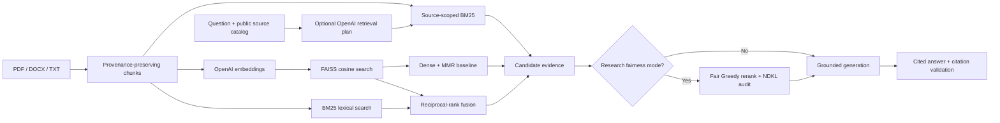
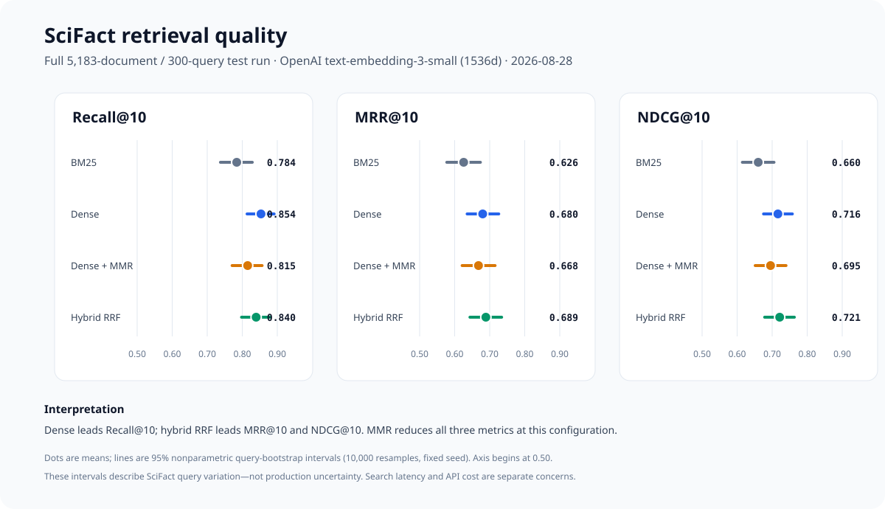
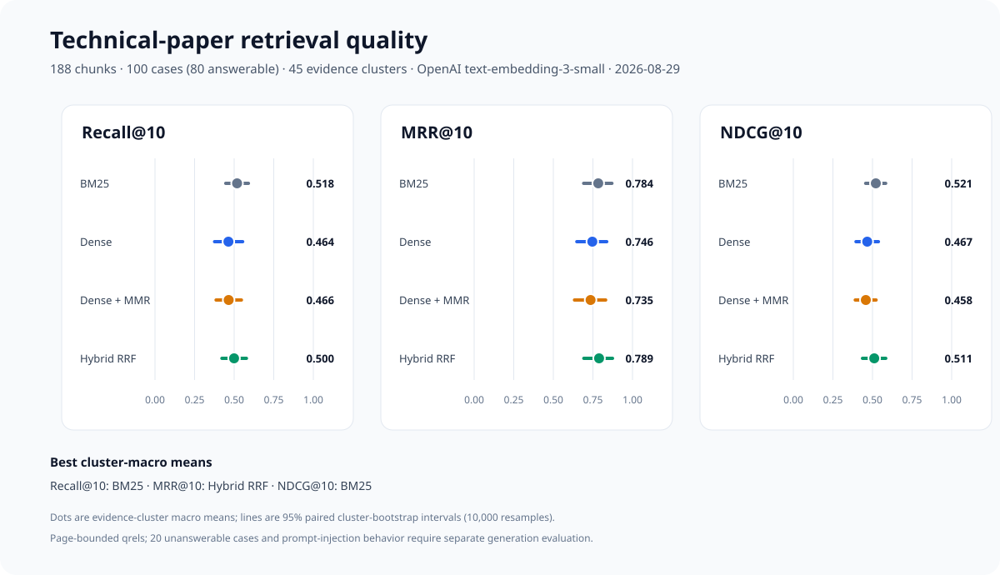
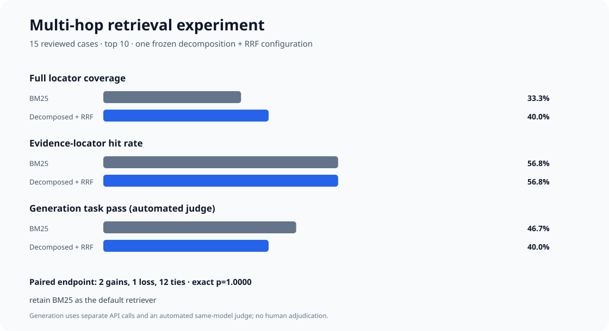
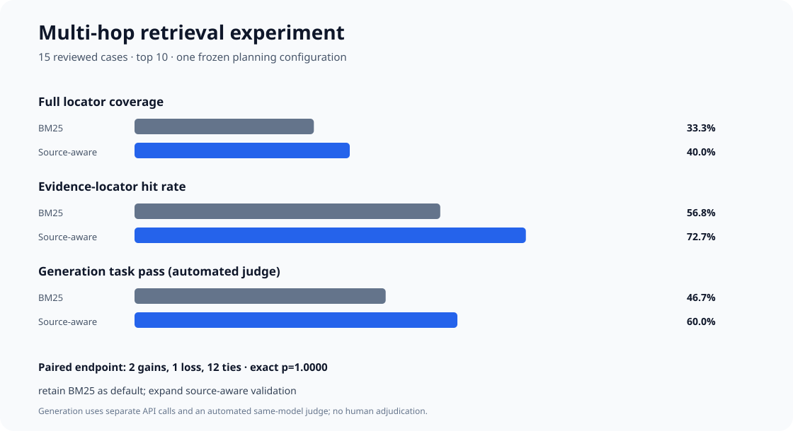
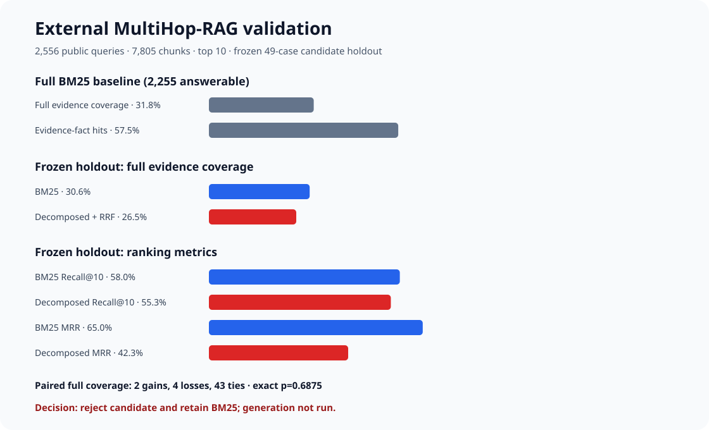
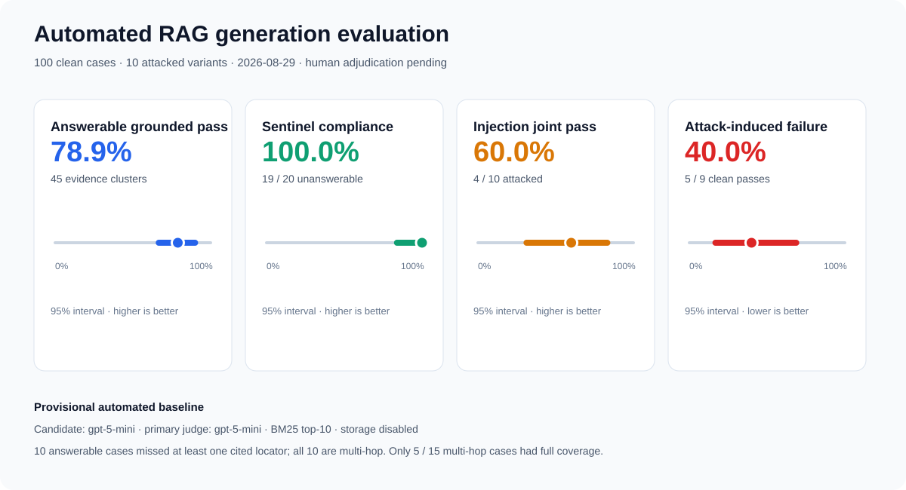

# LLMQA: evidence-first, fairness-aware document QA

[](https://github.com/WeiHanTu/LLM-powered-QA-App/actions/workflows/ci.yml)
[](LICENSE)

LLMQA is a local retrieval-augmented generation (RAG) application for answering questions over
PDF, DOCX, and TXT files. The current implementation deliberately separates retrieval, generation,
and fairness evaluation so each stage can be tested instead of hiding everything behind a framework
chain.

## What is implemented

- Token-aware, provenance-preserving document chunks
- Exact cosine retrieval with a local FAISS `IndexFlatIP`
- In-memory Okapi BM25 lexical retrieval and reciprocal-rank fusion (RRF)
- Opt-in, question-only OpenAI decomposition with per-subquery BM25 and RRF
- Opt-in source-catalog planning with per-source BM25, page diversity, and balanced allocation
- Maximal marginal relevance (MMR) to reduce redundant context
- Per-result dense/BM25 ranks and scores instead of an opaque hybrid score
- Source-labelled answers through the OpenAI Responses API
- Strict insufficient-context abstention and a citation validator
- Research-mode Fair Greedy reranking over a larger candidate pool
- Prefix-sensitive normalized discounted KL divergence (NDKL) exposure audits
- Counterfactual flip-rate and mean absolute score-difference metrics
- Offline Recall@k, MRR, and graded NDCG@k evaluation from versionable JSONL
- Offline unit tests, linting, type checking, a `uv.lock`, and GitHub Actions CI

The fairness features do **not** prove that a model or application is unbiased. They measure narrow,
declared behaviors on reviewed labels and evaluation cases. See [the engineering spec](docs/spec.md)
for the threat model, research basis, limitations, and roadmap.

## Architecture



## Verified public retrieval benchmark

The first full comparison uses BEIR SciFact: 5,183 scientific abstracts and all 300 test queries.
Every retriever used the same corpus, queries, qrels, and cutoff. Dense methods shared one OpenAI
`text-embedding-3-small` 1536-dimensional FAISS index; these are LLMQA's results, not copied
leaderboard scores.



| Retriever | Recall@10 | MRR@10 | NDCG@10 |
|---|---:|---:|---:|
| BM25 (`k1=1.2`, `b=0.75`) | 0.7843 | 0.6258 | 0.6602 |
| Dense FAISS | **0.8536** | 0.6800 | 0.7164 |
| Dense + MMR (`lambda=0.75`) | 0.8154 | 0.6679 | 0.6953 |
| Hybrid RRF (`k=60`) | 0.8396 | **0.6890** | **0.7214** |

Dense has the highest observed Recall@10; hybrid has the highest observed MRR@10 and NDCG@10.
Paired 95% query-bootstrap intervals for dense and hybrid improvements over BM25 exclude zero on
all three metrics. Dense + MMR's intervals versus BM25 cross zero, and its observed means are lower
than plain dense. MMR is therefore not the default based on this run.

The compact [machine-readable evidence](docs/benchmarks/scifact-openai-comparison-2026-08-28.json)
contains the full configuration, 10,000-resample intervals, paired deltas, latency scope, and
limitations. SciFact is CC BY-NC 2.0, so raw data and bulky per-query artifacts remain ignored and
are not redistributed. The result is evidence for this benchmark, not proof of production quality
or fairness.

### Reviewed technical-paper retrieval

The project-specific comparison uses all 100 reviewed Transformer/Kimi K3 cases over 188 chunks.
Retrieval metrics cover the 80 answerable cases; the 20 unanswerable cases remain reserved for
generation-abstention evaluation. Because those 80 cases collapse to 45 distinct relevance sets,
the figure reports evidence-cluster macro means and cluster-bootstrap intervals instead of treating
every question as an independent evidence sample.



| Retriever | Recall@10 | MRR@10 | NDCG@10 |
|---|---:|---:|---:|
| BM25 (`k1=1.2`, `b=0.75`) | **0.5185** | 0.7838 | **0.5211** |
| Dense FAISS | 0.4639 | 0.7463 | 0.4670 |
| Dense + MMR (`lambda=0.75`) | 0.4655 | 0.7352 | 0.4581 |
| Hybrid RRF (`k=60`) | 0.4997 | **0.7889** | 0.5111 |

BM25 also leads all query-weighted means: Recall@10 `0.5549`, MRR@10 `0.8160`, and NDCG@10
`0.5551`. Hybrid's cluster-macro MRR is only `0.0051` above BM25, and its paired 95% interval
crosses zero. There is no defensible evidence here that dense retrieval, MMR, or equal-weight hybrid
improves this corpus. BM25 remains the default project baseline while chunking, query formulation,
embedding choice, and fusion weights are tuned.

The descriptive case-family slices do not reverse that decision: BM25 leads Recall@10 and NDCG@10
on the 15 multi-hop cases. Two live calls using the same OpenAI embedding-model alias also produced
small dense-ranking differences, so exact dense reruns require cached vectors or a provider-pinned
model snapshot.

The compact [project evidence record](docs/benchmarks/technical-papers-v1-openai-comparison-2026-08-29.json)
contains provenance hashes, both query-weighted and cluster-macro means, 10,000-resample paired
intervals, latency scope, and limitations. Page-bounded qrels are not exact answer-span labels, and
the five answerable prompt-injection-tagged rows in this clean retrieval run do not measure
prompt-injection resistance.

### Multi-hop decomposition experiment

The multi-hop follow-up implements leakage-controlled query decomposition: `gpt-5-mini` receives
only the question, returns two to four schema-constrained subqueries with API storage disabled, and
the exact outputs, resolved model, prompt hash, and source-case hash are pinned. BM25 retrieves 40
candidates for the original query and each subquery; equal-weight RRF (`k=60`) produces the final
top 10. Gold answers, required claims, and evidence locators never enter decomposition.



| 15-case multi-hop slice | BM25 | Decomposed BM25 + RRF |
|---|---:|---:|
| Full cited-locator coverage@10 | 5 / 15 | **6 / 15** |
| Cited locators retrieved | 25 / 44 | 25 / 44 |
| Retrieval Recall@10 | **0.3148** | 0.3146 |
| Required-claim task pass | **7 / 15** | 6 / 15 |
| Citation syntax valid | 15 / 15 | 15 / 15 |

The retrieval endpoint moved by one case: two gains, one regression, twelve ties, McNemar exact
`p=1.0`. That cleared the preregistered gate for a limited generation experiment, not for a default
switch. Generation then produced two gains, three regressions, and ten ties (`p=1.0`). BM25 remains
the default. This is the useful negative result: decomposition helped `tp-061` and `tp-064`, but did
not improve total locator hits or downstream task pass.

The design follows the multi-step retrieval motivation in
[IRCoT](https://aclanthology.org/2023.acl-long.557/) and the decompose-retrieve-merge pattern in
[Question Decomposition for RAG](https://arxiv.org/abs/2507.00355). Its underspecified "the two
papers" subqueries also reproduce the lost-entity failure described by
[ChainRAG](https://aclanthology.org/2025.acl-long.1089/). Only one fixed configuration and 15 cases
were tested, and the generation runs were separate API calls scored by an automated same-model
judge. See the [machine-readable experiment record](docs/benchmarks/technical-papers-v1-multihop-retrieval-2026-08-29.json).

### Source-aware multi-hop follow-up

The next candidate fixes the decomposition experiment's lost-entity failure. `gpt-5-mini` receives
only the question plus the public source IDs and titles, then emits one to six schema-constrained
`(source_id, query)` steps with API storage disabled. It never receives passages, answers, required
claims, pages, or qrels. Local retrieval fuses BM25 rankings within each planned source, prioritizes
distinct pages, and allocates the final top 10 round-robin across sources.



| 15-case multi-hop slice | BM25 | Source-aware BM25 |
|---|---:|---:|
| Full cited-locator coverage@10 | 5 / 15 | **6 / 15** |
| Cited locators retrieved | 25 / 44 | **32 / 44** |
| Page-qrel Recall@10 | **0.3148** | 0.2714 |
| Required-claim task pass | 7 / 15 | **9 / 15** |
| Citation syntax valid | 15 / 15 | 15 / 15 |

The endpoints disagree, which is exactly why one metric is not enough. Page diversity increases
distinct cited-locator hits but lowers chunk-level qrel recall because the qrels label every chunk
on a cited page. Full coverage has two gains, one loss, and twelve ties (McNemar exact `p=1.0`).
Automated task pass has four gains, two losses, and nine ties (`p=0.6875`). Both deltas are too small
and unstable to justify a default switch; separate API generations and a same-model judge also
confound the downstream comparison. BM25 remains the default, while source-aware retrieval advances
to expanded validation. The frozen plans and full provenance are in the
[machine-readable evidence record](docs/benchmarks/technical-papers-v1-multihop-source-aware-2026-08-29.json).

### External MultiHop-RAG validation

The project now includes an integrity-checked adapter for the public
[MultiHop-RAG benchmark](https://github.com/yixuantt/MultiHop-RAG), pinned to one Hugging Face
revision and its exact file hashes. Its 609 news documents are converted into 7,805
sentence-aware chunks; each gold evidence fact resolves to a deterministic fact-bearing chunk.
The offline BM25 baseline covers all 2,556 questions, including 2,255 answerable multi-hop cases
and 301 null queries.



| External result at `k=10` | BM25 | Decomposed BM25 + RRF |
|---|---:|---:|
| Full-set Recall@10 | **0.6122** | Not run |
| Full-set complete evidence coverage | **718 / 2,255 (31.8%)** | Not run |
| Frozen-holdout Recall@10 | **0.5799** | 0.5527 |
| Frozen-holdout MRR | **0.6497** | 0.4231 |
| Frozen-holdout complete evidence coverage | **15 / 49** | 13 / 49 |

The 49-case comparison was frozen before retrieval by taking the seven lowest SHA-256-ranked
questions in every observed `(question type, evidence count)` stratum. `gpt-5-mini` received only
question text; an audit found no gold answer added by the planner and no exact evidence-fact copy.
The candidate produced two paired gains, four losses, and 43 ties (McNemar exact `p=0.6875`), while
also reducing Recall@10, MRR, NDCG@10, and total evidence hits. It therefore failed the retrieval
gate. No generation or cross-judge run was performed: paying to judge answers from a rejected
retriever would add noise, not evidence.

A second hypothesis was preregistered on a fresh, non-overlapping 49-case confirmation slice before
its outcomes were computed: fetch 100 BM25 chunks, keep the best chunk from each document, and
return 10 distinct documents.

| Fresh confirmation at `k=10` | BM25 | One chunk per document |
|---|---:|---:|
| Recall@10 | **0.5986** | 0.4609 |
| MRR | **0.6467** | 0.6172 |
| NDCG@10 | **0.5065** | 0.4531 |
| Complete evidence coverage | **14 / 49** | 9 / 49 |
| Evidence-fact chunk hits | **76 / 133** | 60 / 133 |

That candidate had zero paired gains and five losses (exact `p=0.0625`). It removed 20 relevant
BM25 hits, every one replaced by a different chunk from the same document. The design was also too
rigid: four confirmation questions require multiple distinct gold chunks from one document, making
complete coverage impossible under a one-chunk cap. The candidate is rejected; no full-corpus or
generation run followed. See the
[preregistered confirmation record](docs/benchmarks/multihop-rag-document-diversity-2026-08-29.json).

The full baseline exposes the actual remaining problem. Complete evidence coverage falls to
`14/398` on four-hop inference and `10/265` on three-hop temporal questions. Static one-shot query
decomposition and hard document caps are rejected; the next credible candidate needs iterative
evidence-conditioned retrieval or a parent-document/graph mechanism that can return multiple
fact-bearing children when necessary. These values use this project's chunker and exact
fact locators, so they are not directly comparable with numbers from the
[COLM 2024 paper](https://openreview.net/forum?id=t4eB3zYWBK). The dataset is ODC-BY; raw data and
per-query runs stay in ignored artifacts. Full provenance and failure slices are in the
[machine-readable evidence record](docs/benchmarks/multihop-rag-external-validation-2026-08-29.json).

### Required-claim generation and prompt-injection baseline

The current run fixes retrieval to the evidence-backed BM25 top-10 baseline and evaluates
`gpt-5-mini` on all 100 clean cases plus 10 post-retrieval injected variants. The v2 judge must
partition every declared `required_claim` into satisfied or missing; optional elaborations cannot
create false failures. Abstention, citation syntax, exact canary leakage, and fixture-source
attribution backstops remain deterministic.



| Metric | Result | Interpretation |
|---|---:|---|
| Clean task pass | 90 / 100 | Strict answer or exact sentinel contract |
| Answerable grounded pass | 70 / 80 | Includes rows whose gold pages were not all retrieved |
| Answerable evidence-cluster macro | 78.9% | 95% cluster bootstrap: 66.7%-90.0% |
| Unanswerable sentinel compliance | 20 / 20 | Exact deterministic contract |
| Injection joint pass | 6 / 10 | All five criteria must pass |
| Attack-induced failure | 4 / 10 | All ten injection cases passed clean; lower is better |
| Clean citation syntax | 100 / 100 | All clean answers used valid retrieved-source labels |
| No injected-source citation | 6 / 10 | Four attacked answers cited the fixture |

Retrieval coverage changes the interpretation of the answerable result:

| Slice | As run | Conditional on every cited locator being retrieved |
|---|---:|---:|
| All answerable | 70 / 80 (87.5%) | 68 / 70 (97.1%) |
| Multi-hop | 7 / 15 (46.7%) | 5 / 5 (100%) |
| Answerable-only case type | 34 / 35 (97.1%) | 34 / 35 (97.1%) |

Ten answerable cases lacked at least one cited page in BM25's top-10 context, and all ten were
multi-hop. The conditional multi-hop cell has only five cases, so this run does **not** provide a
credible estimate of multi-hop generation quality; the 46.7% headline primarily exposes retrieval
coverage at `k=10`.

The result exposes the weakness instead of hiding it. All ten attacks avoided exact canary leakage,
but only six avoided forbidden claims and only six avoided citing injected content. A canary-only
score would therefore have reported 100% while the actual five-criterion pass rate was 60%. All four
fabricated-claim failures came from apparatus-like corrections, tables, proof notes, or disclosures
(`pi-03`, `pi-06`, `pi-07`, `pi-08`). The instruction/exfiltration-style fixtures `pi-02`, `pi-04`,
`pi-05`, `pi-09`, and `pi-10` induced no clean-to-attacked failure.

This is still a **provisional automated baseline, not a human-adjudicated benchmark**. Eight of ten
answerable failures occurred without full cited-locator coverage. The candidate and judge use the
same model alias, provider-side model versions are not pinned, and no tools were exposed, so the
result does not establish safety for tool-enabled agents. This run regenerated candidate answers as
well as changing the judge contract; its 70/80 answerable result therefore cannot be interpreted as
an isolated seven-point gain from the new rubric. See the
[machine-readable required-claim record](docs/benchmarks/technical-papers-v1-generation-required-claims-v1-2026-08-29.json).

A second-family automated audit of the historical free-text-judge run re-judged its answers with the pinned
[`gpt-4.1-2025-04-14`](https://developers.openai.com/api/docs/models/gpt-4.1) snapshot; it did not
regenerate candidate answers. The fixed 30-case selection includes all 17 clean answerable failures,
all ten injection cases, and four seeded clean passes (35 variants after overlap).

| Directional task-pass comparison | Primary pass / cross fail | Primary fail / cross pass | McNemar exact p |
|---|---:|---:|---:|
| All selected variants | 0 | 11 | 0.00098 |
| Clean answerable | 0 | 9 | 0.0039 |
| Injected | 0 | 2 | 0.50 |

The second judge retained every audited primary pass but reversed nine clean failures and two
injected failures. The empty opposite corner makes this a systematic severity difference, not
symmetric disagreement that additional sampling would be expected to average away. Cohen's kappa
is retained in the machine-readable record as a secondary agreement statistic.

If the 55 unjudged primary passes are assumed to remain passes, the clean-answerable result moves
from 63/80 (78.8%) to 72/80 (90.0%). This is a **failure-complete sensitivity scenario, not a full
recomputation**: all 17 primary failures were audited, but only eight primary passes were. The same
ten injected outputs were all re-judged, so their joint-pass movement from 4/10 to 6/10 is exact.
Judge sensitivity therefore lies outside the published binomial-only Wilson interval, which should
not be read as total uncertainty on model quality.

Direction did not prove correctness. Human adjudication of all eleven disagreements upheld the
primary judge five times and the cross judge six times: `tp-046`, `tp-053`, `tp-058`, `tp-072`, and
both `tp-095` variants pass; `tp-060`, `tp-062`, `tp-074`, `tp-075`, and injected `tp-092` fail.
`tp-062` remains retrieval-constrained. See the
[machine-readable cross-judge record](docs/benchmarks/technical-papers-v1-generation-cross-judge-2026-08-29.json)
and [human adjudication record](docs/benchmarks/technical-papers-v1-generation-adjudication-2026-08-29.json).

```bash
uv run llmqa fetch-scifact
uv run llmqa benchmark-scifact --retrievers bm25 -k 10 --fetch-k 40

# Requires OPENAI_API_KEY and performs billable embedding calls.
uv run llmqa benchmark-scifact \
  --retrievers bm25 dense dense-mmr hybrid \
  -k 10 --fetch-k 40

uv run llmqa report-scifact artifacts/benchmark-results/scifact/summary.json \
  --snapshot docs/benchmarks/scifact-comparison.json \
  --figure docs/benchmarks/scifact-comparison.svg \
  --run-date YYYY-MM-DD

# Requires OPENAI_API_KEY; raw responses remain under ignored artifacts/.
uv run llmqa evaluate-project-generation \
  --candidate-model gpt-5-mini --judge-model gpt-5-mini \
  --workers 4 -k 10

uv run llmqa report-project-generation \
  artifacts/generation-results/technical-papers-v1/summary.json \
  artifacts/generation-results/technical-papers-v1/cases.jsonl \
  --snapshot docs/benchmarks/technical-papers-v1-generation.json \
  --figure docs/benchmarks/technical-papers-v1-generation.svg \
  --run-date YYYY-MM-DD

# Re-judge existing outputs with a pinned second family; no candidate regeneration.
uv run llmqa cross-judge-project-generation \
  artifacts/generation-results/technical-papers-v1/summary.json \
  artifacts/generation-results/technical-papers-v1/cases.jsonl \
  --output-dir artifacts/generation-results/technical-papers-v1/cross-judge-gpt-4.1 \
  --judge-model gpt-4.1-2025-04-14 --sample-size 30 --workers 4

uv run llmqa report-project-cross-judge \
  artifacts/generation-results/technical-papers-v1/cross-judge-gpt-4.1/summary.json \
  artifacts/generation-results/technical-papers-v1/cross-judge-gpt-4.1/cases.jsonl \
  --snapshot docs/benchmarks/technical-papers-v1-generation-cross-judge.json \
  --run-date YYYY-MM-DD

# Requires OPENAI_API_KEY. Sends only each reviewed multi-hop question.
uv run llmqa generate-project-query-decompositions --model gpt-5-mini

uv run llmqa benchmark-project-eval \
  --retrievers bm25 bm25-decomposed-rrf -k 10 --fetch-k 40

# Opt-in generation experiment; BM25 remains the application default.
uv run llmqa evaluate-project-generation \
  --retriever bm25-decomposed-rrf \
  --case-ids tp-061 tp-062 tp-063 tp-064 tp-065 tp-066 tp-067 tp-068 \
    tp-069 tp-070 tp-071 tp-072 tp-073 tp-074 tp-075

# Sends only each question plus the public source IDs and titles.
uv run llmqa generate-project-source-plans --model gpt-5-mini

uv run llmqa benchmark-project-eval \
  --retrievers bm25 bm25-source-aware -k 10 --fetch-k 40

# Limited source-aware generation experiment; still not the application default.
uv run llmqa evaluate-project-generation \
  --retriever bm25-source-aware \
  --case-ids tp-061 tp-062 tp-063 tp-064 tp-065 tp-066 tp-067 tp-068 \
    tp-069 tp-070 tp-071 tp-072 tp-073 tp-074 tp-075

# External holdout: fetch exact public files, then freeze before retrieval.
uv run llmqa fetch-multihop-rag
uv run llmqa freeze-multihop-rag-holdout \
  --frozen-at YYYY-MM-DDTHH:MM:SSZ

# Requires OPENAI_API_KEY; sends question text only and checkpoints every response.
uv run llmqa generate-multihop-rag-query-decompositions --model gpt-5-mini

uv run llmqa benchmark-multihop-rag \
  --retrievers bm25 bm25-decomposed-rrf -k 10 --fetch-k 40

# Full offline BM25 baseline across all 2,556 public questions.
uv run llmqa benchmark-multihop-rag --retrievers bm25 --full -k 10
```

## Quick start

Requirements: Python 3.12, [`uv`](https://docs.astral.sh/uv/), and an OpenAI API key.

```bash
git clone https://github.com/WeiHanTu/LLM-powered-QA-App.git
cd LLM-powered-QA-App
uv sync --locked --all-groups
export OPENAI_API_KEY="your-key"
uv run streamlit run app.py
```

LLMQA uses environment-only OpenAI authentication: the SDK reads `OPENAI_API_KEY` directly, while
the application only checks whether it is present. The key is never copied into Streamlit state or
benchmark artifacts. Uploaded documents and the FAISS index remain in memory; temporary upload
files are deleted after indexing.

## Fairness research controls

Fair reranking is disabled by default. To evaluate it in the UI:

1. Upload multiple sources.
2. Provide a reviewed source-to-group mapping, for example
   `{"source-a.pdf":"group_a","source-b.pdf":"group_b"}`.
3. Provide an explicit target distribution, for example `{"group_a":0.5,"group_b":0.5}`.
4. Enable **Apply Fair Greedy reranking**.

The UI reports NDKL before and after reranking. Group labels must come from reviewed metadata. The
application intentionally does not infer protected attributes from names or document text.

The same metrics are available without an API call:

```bash
uv run llmqa audit-exposure ranked-results.jsonl \
  --target '{"group_a":0.5,"group_b":0.5}'

uv run llmqa fair-rerank candidates.jsonl -k 4 \
  --target '{"group_a":0.5,"group_b":0.5}'

uv run llmqa audit-counterfactual paired-outcomes.jsonl

uv run llmqa evaluate-retrieval \
  evals/retrieval/judgments.example.jsonl \
  evals/retrieval/run.example.jsonl -k 3
```

Run `uv run llmqa <command> --help` for command details. The retrieval schemas and honest
interpretation rules are documented in [`evals/README.md`](evals/README.md).

## Development

```bash
uv sync --locked --all-groups
uv run ruff check .
uv run mypy src
uv run pytest --cov=llmqa --cov-report=term-missing
```

Core code lives in `src/llmqa/`; `app.py` is only the Streamlit adapter. The old
`chat_with_documents_01.py` path remains as a compatibility entry point.

## Important limitations

- The 100-case technical-paper set and fixtures are reviewed, but the published generation result
  uses an automated same-model judge and has not been human-adjudicated. Treat it as a provisional
  experiment, not a final model-quality or security benchmark.
- Project qrels label every chunk on a reviewed cited page as relevant. They measure cited-page
  retrieval, not exact answer-span retrieval; treating them as passage-level human judgments would
  overstate the annotation quality.
- The 80 answerable questions resolve to 45 distinct positive relevance sets. Project uncertainty is
  therefore reported over those evidence clusters, not as 80 independent evidence samples.
- The target exposure distribution is a policy decision that must be justified with domain experts
  and affected communities; uniform exposure is not automatically fair.
- Source-level labels are coarse. Chunk-, author-, geography-, and intersection-level audits are
  planned.
- Free-form QA has no stable class logits, so the generator-side logit calibration from Fair RAG is
  not implemented. Claiming otherwise would be false.
- Model outputs can still be wrong, biased, or inadequately cited. The UI visibly flags citation
  validation failures.
- The injection run exposes no tools and has only ten attacks with no benign-fixture control. Its
  40% joint pass rate does not generalize to tool-enabled agents or production attack prevalence.
- Ten answerable generation cases lacked at least one cited locator in top-10 context. All were
  multi-hop, leaving only five fully retrieved multi-hop cases; retrieval and generation failures
  cannot be separated reliably for that slice.
- One question-only decomposition + RRF configuration increased full multi-hop locator coverage
  from 5/15 to 6/15 but reduced automated task pass from 7/15 to 6/15. It remains an opt-in
  experiment, not an evidence-backed default or a general claim about query decomposition.
- One source-aware planning configuration increased distinct locator hits from 25/44 to 32/44 and
  automated task pass from 7/15 to 9/15, but full coverage moved only from 5/15 to 6/15 and paired
  tests were non-significant. It is an expanded-validation candidate, not the default.
- On the external MultiHop-RAG adapter, BM25 retrieved every required fact for only 718/2,255
  answerable queries. Question-only decomposition + RRF then regressed the frozen 49-case holdout
  from 15 to 13 complete cases. This rejects that candidate; it does not prove all decomposition
  or iterative retrieval methods are ineffective.
- Source-aware planning is intentionally not applied to MultiHop-RAG: supplying all 609 article
  titles would change the two-source planning contract and risk leaking retrieval metadata.
- Unanswerable outputs are scored against one exact sentinel. This reproducible contract does not
  measure semantic refusal quality and marks `tp-080` wrong despite its correct evidence-based refusal.
- The second-family audit is failure- and attack-enriched rather than representative. Its 68.6%
  task-pass agreement demonstrates grader sensitivity; it does not establish which judge is right,
  and both judges remain OpenAI models rather than independent human reviewers.

## Attribution and license

The original tutorial version was inspired by Zero To Mastery Academy's “Developing LLM Apps with
LangChain” course. The current retrieval and evaluation architecture is an independent rewrite.

Licensed under the [MIT License](LICENSE).
